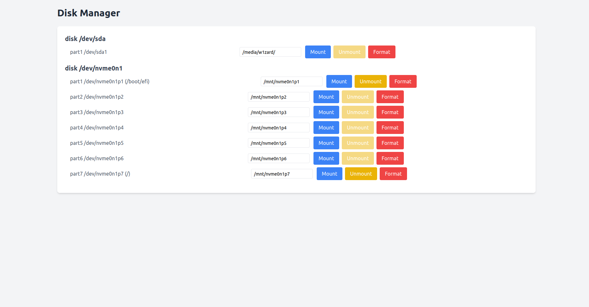

# Disk Manager

**⚠️ ВАЖНО: Все операции выполняются ТОЛЬКО в изолированной виртуальной машине! Это обеспечивает полную безопасность для вашей основной системы!**

---

## 📋 Описание проекта

**Disk Manager** — это веб-приложение на основе **FastAPI**, разработанное для управления физическими дисками в виртуальной машине на базе Ubuntu/Debian. Приложение позволяет:

- Просматривать список физических дисков (без разделов) с информацией об имени, размере и точке монтирования.
- Выполнять операции монтирования, размонтирования и форматирования целых дисков через удобный веб-интерфейс.

Приложение соответствует техническому заданию, отображая только физические диски (например, `/dev/sda`, `/dev/nvme0n1`) и предоставляя кнопки для управления ими.

---

## 🎯 Соответствие техническому заданию

Приложение полностью соответствует требованиям ТЗ:

1. **Функциональность**:
   - **Монтирование диска**: Эндпоинт `/mount` монтирует диск (например, `/dev/sda`) в указанную точку монтирования, если на диске есть файловая система.
   - **Размонтирование диска**: Эндпоинт `/unmount` размонтирует диск и все его смонтированные разделы.
   - **Форматирование диска**: Эндпоинт `/format` форматирует весь диск (уничтожая все разделы) в выбранную файловую систему (`ext4`, `vfat`, `ntfs`) с защитой системного диска.
2. **Интерфейс**:
   - Отображаются только физические диски в структурированном виде.
   - Для каждого диска показаны:
     - Имя диска (например, `/dev/sda`).
     - Размер (например, `14.5G`).
     - Точка монтирования (если диск смонтирован, обычно пустая).
     - Кнопки: **Монтировать**, **Размонтировать**, **Форматировать** (с выбором файловой системы).
3. **Безопасность**:
   - Приложение тестировалось в изолированной виртуальной машине (Ubuntu 22.04.5).
   - Защита от форматирования системного диска (`/dev/nvme0n1`).
   - Подтверждение перед форматированием для предотвращения случайного удаления данных.

---

## 📷 Скриншот интерфейса



*Ожидаемое содержимое скриншота*:
- Заголовок «Управление дисками».
- Список дисков, например:
  - `диск /dev/sda (14.5G)` с полем для точки монтирования (например, `/mnt/sda`), кнопками «Монтировать» (синяя), «Размонтировать» (желтая, отключена, если диск не смонтирован), и «Форматировать» (красная, с выпадающим списком `ext4`, `vfat`, `ntfs`).
  - Аналогично для других дисков (например, `/dev/nvme0n1 (953.9G)`).
- Сообщения об успехе (зеленые) или ошибке (красные) под каждым диском.

---

## 🛠 Установка и запуск

### Требования

- Python 3.8+
- Ubuntu/Debian (в виртуальной машине)
- Утилиты: `lsblk`, `mount`, `umount`, `mkfs` (`dosfstools` и `ntfs-3g` для поддержки `vfat` и `ntfs`)
- FastAPI и зависимости

### Установка

1. **Клонируйте репозиторий**:

   ```bash
   git clone https://github.com/your-username/disk-manager.git
   cd disk-manager
   ```

2. **Создайте виртуальное окружение**:

   ```bash
   python3 -m venv venv
   source venv/bin/activate
   ```

3. **Установите зависимости**:

   ```bash
   pip install fastapi uvicorn jinja2
   ```

4. **Установите системные утилиты**:

   ```bash
   sudo apt update
   sudo apt install dosfstools ntfs-3g
   ```

5. **Настройте права `sudo`**:

   - Разрешите выполнение `mount`, `umount`, `mkfs`, и `lsblk` без пароля:

     ```bash
     sudo visudo
     ```

     Добавьте:

     ```
     your-username ALL=(ALL) NOPASSWD: /usr/bin/mount, /usr/bin/umount, /usr/sbin/mkfs, /usr/bin/lsblk
     ```

     Замените `your-username` на вашего пользователя (например, `user1`).

6. **Создайте папку `templates`**:

   - Поместите файл `index.html` (из репозитория) в папку `templates` в корне проекта.

### Запуск приложения

1. Запустите FastAPI-сервер:

   ```bash
   python app.py
   ```

2. Откройте браузер и перейдите на `http://127.0.0.2:8000`.

---

## 📂 Структура проекта

```
disk-manager/
│
├── app.py              # Основной файл FastAPI-приложения
├── templates/
│   └── index.html      # Шаблон интерфейса с Tailwind CSS
├── screenshot.png      # Скриншот интерфейса
└── README.md           # Документация
```

---

## 🔍 Использование

1. **Просмотр дисков**:
   - На главной странице (`/`) отображаются только физические диски, полученные с помощью `lsblk`.
   - Показаны имя, размер и точка монтирования (обычно пустая, если диск не смонтирован).

2. **Монтирование**:
   - Введите точку монтирования (например, `/mnt/sda`) и нажмите «Монтировать».
   - Диск должен иметь файловую систему (`ext4`, `vfat`, `ntfs`), иначе требуется форматирование.

3. **Размонтирование**:
   - Нажмите «Размонтировать» для размонтирования диска или его разделов.

4. **Форматирование**:
   - Выберите файловую систему (`ext4`, `vfat`, `ntfs`) и нажмите «Форматировать».
   - Подтвердите действие в диалоговом окне (форматирование уничтожает все данные и разделы!).

---

## 🛡 Безопасность

- **Изолированная ВМ**: Приложение тестировалось в виртуальной машине (Ubuntu 24.04) с несколькими виртуальными дисками.
- **Защита системного диска**: Эндпоинт `/format` блокирует форматирование `/dev/nvme0n1`.
- **Подтверждение форматирования**: Требуется подтверждение в интерфейсе для предотвращения случайного удаления данных.

---

## 🔗 Репозиторий

[GitHub: Disk Manager](https://github.com/W1zard70r/WebMount)

---

## 🚀 Тестирование

1. **Создайте виртуальную машину** (например, VirtualBox с Ubuntu 24.04).
2. **Добавьте виртуальные диски**:
   - Создайте несколько виртуальных дисков (например, 10 ГБ и 20 ГБ).
   - Подключите USB-устройство через USB-passthrough.
3. **Проверьте диски**:
   ```bash
   lsblk
   ```
4. **Подготовьте диск для монтирования**:
   - Если монтирование не работает, отформатируйте диск:
     ```bash
     curl -X POST -F "device=/dev/sda" -F "filesystem=ext4" http://127.0.0.2:8000/format
     ```
5. **Запустите приложение** и протестируйте операции:
   - **Форматирование**: Выберите `ext4` для `/dev/sda`, подтвердите действие.
   - **Монтирование**: Введите `/mnt/sda` и нажмите «Монтировать».
   - **Размонтирование**: Нажмите «Размонтировать» для `/dev/sda`.
   - Проверьте результат:
     ```bash
     lsblk -f /dev/sda
     ```
6. **Проверьте ошибки**:
   - Если монтирование не работает, проверьте файловую систему:
     ```bash
     lsblk -f /dev/sda
     ```
   - Если диск не имеет файловой системы, отформатируйте его через интерфейс.
   - Используйте эндпоинт `/debug` для отладки:
     ```python
     @app.get("/debug")
     async def debug():
         disks = await get_disks()
         return disks
     ```
     Перейдите на `http://127.0.0.2:8000/debug` для просмотра данных.

---

## 📝 Примечания

- **Монтирование дисков**: Для монтирования диск должен иметь файловую систему (`ext4`, `vfat`, `ntfs`). Если диск содержит таблицу разделов, отформатируйте его перед монтированием.
- **Форматирование**: Уничтожает все данные и разделы на диске. Используйте с осторожностью!
- **Автоматическое монтирование**: Ubuntu может автоматически монтировать разделы (например, `/dev/sda1` в `/media/w1zard/SANE4KA`). Размонтируйте их перед форматированием.